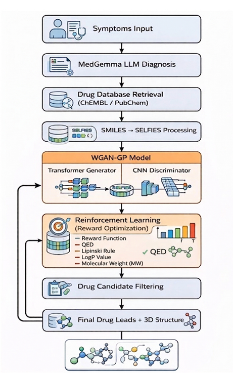
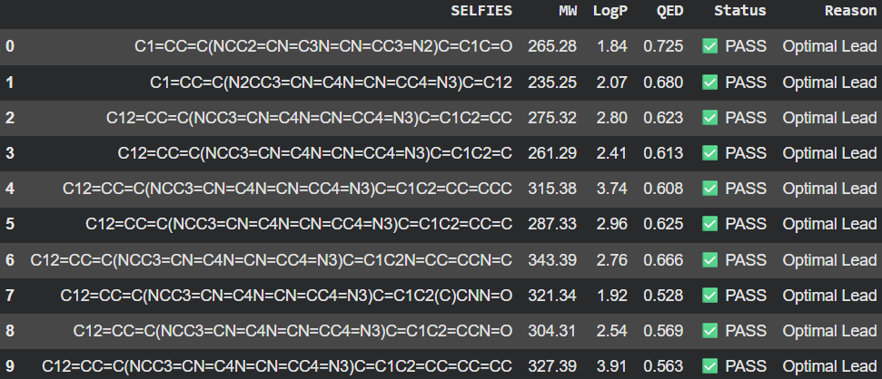
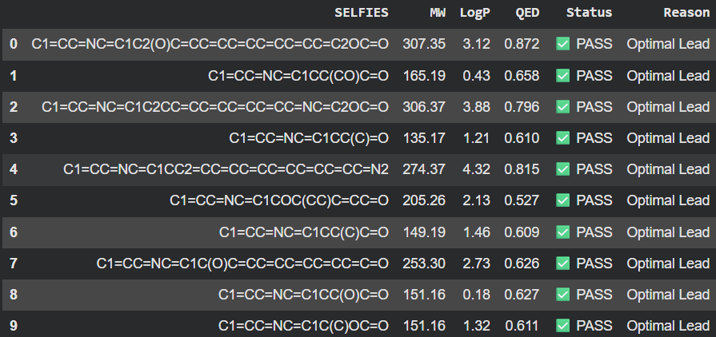
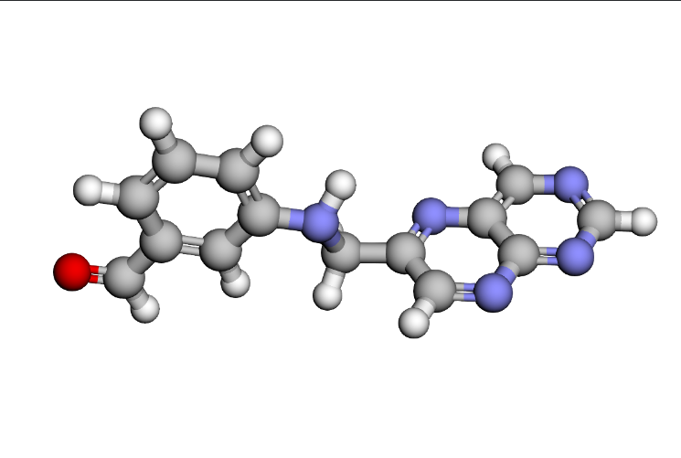
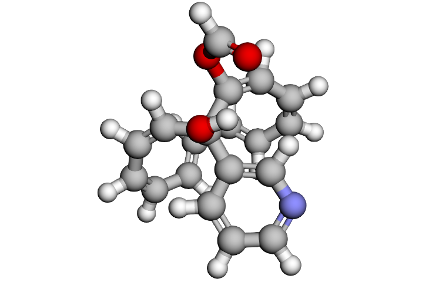

# 🧬 Intelligent Molecule Generator for Drug Discovery using WGAN-GP, Reinforcement Learning and SELFIES

An AI-powered drug discovery framework that generates novel drug-like molecules using **SELFIES**, **WGAN-GP**, and **Reinforcement Learning**. The system learns molecular distributions from known drug compounds, generates chemically valid candidate molecules, optimizes them using molecular property rewards, and visualizes promising leads in 3D.

---

## 📌 Overview

Traditional drug discovery is time-consuming, computationally expensive, and requires screening millions of compounds. This project leverages deep generative models and reinforcement learning to automate the generation of novel drug-like molecules.

The pipeline consists of:

- Converting molecular structures into **SELFIES**
- Learning molecular distributions using **WGAN-GP**
- Generating novel candidate molecules
- Optimizing molecules through **Reinforcement Learning**
- Evaluating molecular properties (QED, LogP, Molecular Weight, Synthesizability)
- Visualizing chemically valid molecules using **RDKit**

---

# 🏗️ System Architecture

<p align="center">
  
</p>

The complete workflow consists of:

1. Disease diagnosis using an LLM (MedGemma)
2. Retrieval of existing drug leads from ChEMBL/PubChem
3. Conversion of SMILES into SELFIES representation
4. Training a WGAN-GP model
5. Reinforcement Learning based molecular optimization
6. Drug candidate filtering
7. 3D molecular visualization

---

# 🔄 Project Workflow

<p align="center">
  
</p>

The complete pipeline follows these steps:

### 1. Convert Molecular Structures into SELFIES

SELFIES (Self-Referencing Embedded Strings) provide a robust molecular representation that guarantees chemically valid molecule generation.

↓

### 2. Train a WGAN-GP Model

A Wasserstein GAN with Gradient Penalty learns the probability distribution of drug-like molecules using a Transformer Generator and CNN Discriminator.

↓

### 3. Generate Candidate Molecules

The trained generator creates new molecular structures represented as SELFIES.

↓

### 4. Reinforcement Learning Optimization

Each generated molecule is rewarded based on desirable pharmaceutical properties including:

- Drug-likeness (QED)
- LogP
- Molecular Weight
- Synthesizability
- Lipinski's Rule

↓

### 5. Molecular Evaluation

Generated molecules are filtered and ranked using:

- ✅ Quantitative Estimate of Drug-likeness (QED)
- ✅ LogP
- ✅ Molecular Weight
- ✅ Synthesizability Score

↓

### 6. RDKit Visualization

The final optimized molecules are converted into 2D and 3D molecular structures for visualization and further analysis.

---

# ✨ Features

- SELFIES-based molecular representation
- Transformer-based Generator
- CNN Discriminator
- WGAN-GP Training
- Reinforcement Learning optimization
- Drug-likeness evaluation
- Lipinski Rule filtering
- Molecular visualization using RDKit
- Generation of novel candidate molecules

---

# 🛠️ Tech Stack

| Category | Tools |
|-----------|------|
| Language | Python |
| Deep Learning | PyTorch |
| Molecular Processing | RDKit |
| Molecular Representation | SELFIES |
| Dataset | ChEMBL, PubChem |
| GAN | WGAN-GP |
| Reinforcement Learning | Reward-based Optimization |
| Visualization | RDKit |
| Notebook | Jupyter / Google Colab |

---

# 📂 Project Structure

```
Intelligent-Molecule-Generator/
│
├── data/
├── models/
├── notebooks/
├── images/
│   ├── architecture.png
│   ├── workflow.png
│   ├── result1.png
│   ├── result2.png
│   ├── molecule1.png
│   └── molecule2.png
│
├── utils/
├── train.py
├── generate.py
├── evaluate.py
├── requirements.txt
└── README.md
```

---

# 📊 Results

## Generated Drug Candidates

The trained model successfully generated chemically valid molecules satisfying drug-likeness constraints.

<p align="center">
  
</p>

Example generated molecules with their molecular properties:

| Metric | Description |
|---------|-------------|
| MW | Molecular Weight |
| LogP | Lipophilicity |
| QED | Drug-likeness Score |
| Status | PASS/FAIL |
| Reason | Candidate Evaluation |

---

## Additional Generated Molecules

<p align="center">
  
</p>

The reinforcement learning stage improves molecular quality while maintaining chemical validity.

---

# 🧪 Example 3D Molecular Structures

### Molecule 1

<p align="center">
  
</p>

---

### Molecule 2

<p align="center">
  
</p>

The generated molecules satisfy multiple pharmaceutical constraints while maintaining structural diversity.

---

# 📈 Evaluation Metrics

Generated molecules are evaluated using:

- Quantitative Estimate of Drug-likeness (QED)
- Molecular Weight (MW)
- LogP
- Synthesizability Score
- Lipinski Rule of Five
- Chemical Validity
- Structural Diversity

---

# 🚀 Installation

Clone the repository

```bash
git clone https://github.com/WhiteInfinite/Intelligent-Molecule-Generator-for-Drug-Discovery-using-GANs-Reinforcement-Learning-and-SELFIES.git

cd Intelligent-Molecule-Generator-for-Drug-Discovery-using-GANs-Reinforcement-Learning-and-SELFIES
```

Install dependencies

```bash
pip install -r requirements.txt
```

---

# ▶️ Usage

Train the model

```bash
python train.py
```

Generate molecules

```bash
python generate.py
```

Evaluate molecules

```bash
python evaluate.py
```

---

# 🎯 Future Improvements

- Graph Neural Network discriminator
- Diffusion-based molecule generation
- Multi-objective Reinforcement Learning
- Protein-Ligand Docking Integration
- ADMET prediction
- Molecular toxicity prediction
- Molecular similarity search
- Real-time web application using Streamlit

---

# 📚 References

- SELFIES: A Robust Representation of Semantically Constrained Graphs
- Wasserstein GAN with Gradient Penalty (WGAN-GP)
- RDKit
- ChEMBL Database
- PubChem Database

---

# 👨‍💻 Author

**Liyan C K M**

B.Tech Computer Science and Engineering

College of Engineering Trivandrum (CET)

---

# ⭐ If you found this project useful, consider giving it a star!
